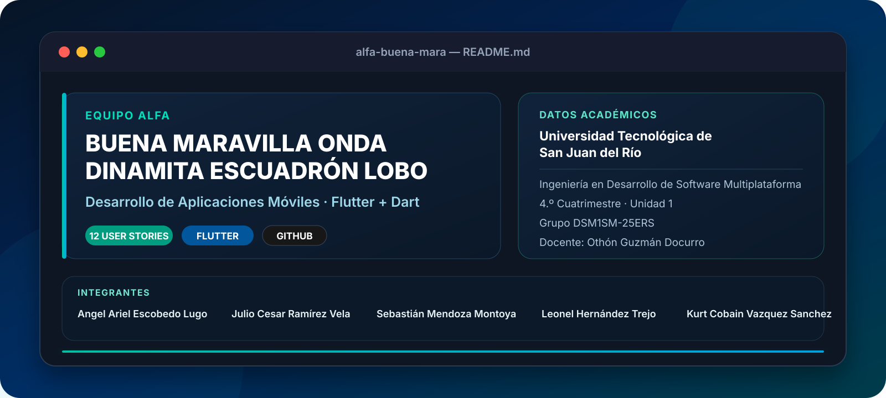

<div align="center">



<br>


<br><br>


<br>

> **Nueva implementación. Nueva metodología. Mismas historias de usuario, una base completamente limpia.**

</div>

---

## 🎓 Datos académicos

<div align="center">

| | |
|:--|:--|
| 🏛️ **Universidad** | Universidad Tecnológica de San Juan del Río |
| 🎓 **Carrera** | Ingeniería en Desarrollo de Software Multiplataforma |
| 📱 **Materia** | Desarrollo de Aplicaciones Móviles |
| 📚 **Cuatrimestre** | 4.º Cuatrimestre |
| 🧩 **Unidad** | Unidad 1 |
| 👥 **Grupo** | DSM1SM-25ERS |
| 👨‍🏫 **Docente** | Othón Guzmán Docurro |
| 🐺 **Equipo** | Alfa Buena Maravilla Onda Dinamita Escuadrón Lobo |

</div>

---

## 👥 Escuadrón

<div align="center">

<table>
<tr>
<td align="center" width="20%"><b>Angel Ariel<br>Escobedo Lugo</b></td>
<td align="center" width="20%"><b>Julio Cesar<br>Ramírez Vela</b></td>
<td align="center" width="20%"><b>Sebastián<br>Mendoza Montoya</b></td>
<td align="center" width="20%"><b>Leonel<br>Hernández Trejo</b></td>
<td align="center" width="20%"><b>Kurt Cobain<br>Vazquez Sanchez</b></td>
</tr>
</table>

**5 integrantes · 1 repositorio · 12 historias de usuario**

</div>

---

## 🚀 El proyecto

Este repositorio representa una **nueva implementación desde cero en Flutter** de las historias de usuario del proyecto de Desarrollo de Aplicaciones Móviles.

El repositorio anterior de **Equipo SixSeven** se utilizó únicamente como referencia documental para recuperar los requerimientos de **US01 a US12**. No se reutilizó su proyecto Android, sus clases Kotlin, Gradle, recursos visuales ni su arquitectura anterior.

La intención es mantener una separación clara entre ambas etapas: este repositorio será construido con **Flutter + Dart**, empleando una nueva metodología de trabajo y una organización propia para el equipo Alfa.

---

## 📋 Historias de usuario

<table>
<tr>
<td width="50%" valign="top">

### 🔐 Épica 1 · Autenticación

- [US01 · Login y asignación local de perfiles](docs/user-stories/US01-login-y-asignacion-local-de-perfiles.md)
- [US02 · Cierre de sesión y limpieza de credenciales](docs/user-stories/US02-cierre-de-sesion-y-limpieza-de-credenciales.md)

### 🛍️ Épica 2 · Catálogo

- [US03 · Visualizar catálogo general](docs/user-stories/US03-visualizar-catalogo-general-de-productos.md)
- [US04 · Filtrar productos por categoría](docs/user-stories/US04-filtrar-productos-por-categoria.md)
- [US05 · Ver detalle del producto](docs/user-stories/US05-ver-detalle-del-producto-con-interfaz-dinamica.md)

</td>
<td width="50%" valign="top">

### 📦 Épica 3 · Inventario

- [US06 · Agregar nuevo producto](docs/user-stories/US06-agregar-nuevo-producto-al-catalogo.md)
- [US07 · Editar información de un artículo](docs/user-stories/US07-editar-informacion-de-un-articulo.md)
- [US08 · Eliminar producto](docs/user-stories/US08-eliminar-producto-del-sistema.md)

### 🛒 Épica 4 · Compras

- [US09 · Añadir artículos al carrito](docs/user-stories/US09-anadir-articulos-al-carrito-personal.md)
- [US10 · Gestionar artículos del carrito](docs/user-stories/US10-visualizar-modificar-o-eliminar-articulos-del-carrito.md)

### 🔎 Épica 5 · Auditorías

- [US11 · Listar usuarios registrados](docs/user-stories/US11-listar-todos-los-usuarios-registrados.md)
- [US12 · Histórico global de carritos](docs/user-stories/US12-visualizar-historico-de-carritos-globales.md)

</td>
</tr>
</table>

<div align="center">

📖 **[Consultar el índice completo de historias de usuario](docs/user-stories/README.md)**

</div>

---

## 🧰 Stack de esta versión

<div align="center">

| Tecnología | Uso dentro del proyecto |
|:--:|:--|
| **Flutter** | Framework principal de la aplicación |
| **Dart** | Lenguaje de desarrollo |
| **Fake Store API** | Fuente remota para autenticación, productos, usuarios y carritos |
| **Git** | Control de versiones |
| **GitHub** | Repositorio, colaboración y trazabilidad |

</div>

---

## 🗂️ Estado actual del repositorio

```text
AlfaBuenaMaravillaOndaDinamitaEscuadronLobo/
│
├── README.md
└── docs/
    ├── readme-equipo-alfa.svg
    └── user-stories/
        ├── README.md
        ├── US01-...
        ├── US02-...
        ├── ...
        └── US12-...
```

La base de código Flutter se incorporará sobre esta documentación, manteniendo los requerimientos separados de la implementación para evitar mezclar decisiones heredadas del proyecto anterior.

---

## 🧭 Principios del nuevo desarrollo

- **Partir de requerimientos, no del código anterior.**
- Mantener cada historia de usuario **identificable y trazable**.
- Trabajar sobre una base Flutter organizada desde el inicio.
- Separar documentación, lógica, interfaz y acceso a datos.
- Evitar incorporar archivos o dependencias heredadas sin una razón técnica.
- Mantener commits comprensibles y cambios atribuibles a cada integrante.

---

<div align="center">

### 🐺 EQUIPO ALFA BUENA MARAVILLA ONDA DINAMITA ESCUADRÓN LOBO

**Universidad Tecnológica de San Juan del Río**  
Ingeniería en Desarrollo de Software Multiplataforma · 4.º Cuatrimestre

`Flutter` · `Dart` · `Git` · `GitHub`

<br>

**Hecho para aprender, iterar y construirlo mejor desde cero.**

</div>
